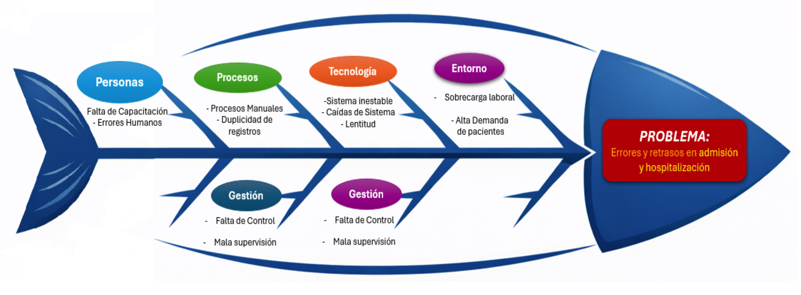

# 🏥 Sistema de Gestión Hospitalaria

---

## 📌 - Identificar el problema del proyecto

Actualmente, el proceso de admisión y hospitalización presenta fallas importantes debido al uso de registros manuales y sistemas poco confiables. Esto genera errores en la información, retrasos en la atención y una mala experiencia para el paciente.

Además, no existe un control adecuado sobre la información clínica ni herramientas que permitan analizar datos para mejorar la gestión del hospital.

---

## 🧠 - Análisis del problema - Método Ishikawa
Se incorpora diagrama de causa-efecto que permite visualizar las principales causas del problema identificado.

  

 

---

## 📚 - Documentación de antecedentes (Formato APA)

La digitalización en el sector salud ha demostrado ser clave para mejorar la eficiencia y reducir errores en los procesos hospitalarios.

📖 **Kawak. (2023).** *Gestión documental para el sector salud, facilita tus procesos.*  
La gestión documental en salud busca reducir el papeleo y mejorar el acceso inmediato a la información, la seguridad de los datos y la productividad del personal.  
🔗 https://blog.kawak.net/es-mx/mejorando_sistemas_de_gestion_iso/gestion-documental-sector-salud  

📖 **Ticportal. (2023).** *La elección de un sistema de gestión documental en el sector sanitario.*  
En el sector sanitario, el crecimiento de la documentación clínica exige control de versiones, niveles de acceso y trazabilidad.  
🔗 https://www.ticportal.es/temas/sistema-gestion-documental/gestion-documental-sectores/dms-sanitaria  

📖 **Polo del Conocimiento. (2025).** *TIC para la gestión documental en el área de estadística del Hospital Rafael Ruiz del Cantón Pujilí.*  
El estudio evidencia que persisten prácticas manuales que ralentizan la generación de reportes y dificultan el acceso oportuno a la información.  
🔗 https://polodelconocimiento.com/ojs/index.php/es/article/download/9865/pdf  

---

## ⚠️ - Identificar restricciones del proyecto

- ⏳ Tiempo limitado para el desarrollo del sistema  
- 💰 Presupuesto reducido  
- 🌐 Dependencia de la conectividad de red  
- 👥 Resistencia del personal al cambio  
- 🖥️ Infraestructura tecnológica limitada  

---

## 💡 - Proponer alternativas de solución

### 🔹 Alternativa 1: Mejorar el sistema actual  
Requiere menor inversión, pero no soluciona los problemas de fondo.

### 🔹 Alternativa 2: Implementar software externo  
Permite una implementación rápida, pero tiene alto costo y baja flexibilidad.

### ✅ Alternativa 3: Desarrollar un sistema propio (Elegida)  
Permite adaptar el sistema a las necesidades del hospital y escalarlo en el tiempo.

#### 📊 Sustento de la Alternativa Elegida
| Criterio | Alt 1: Mejora Sistema Actual | Alt 2: Software Externo (SaaS) | Alt 3: Desarrollo Propio |
| :--- | :--- | :--- | :--- |
| **Control de Datos** | Alto | Bajo (Terceros) | **Total (Soberanía)** |
| **Costo a largo plazo** | Bajo | Alto (Mensualidades) | **Bajo (Mantenimiento)** |
| **Personalización** | Nula | Limitada | **Total (A medida)** |

---

## 🎯 - Definir objetivos y alcance

### 🏁 Objetivo General  
Desarrollar un sistema de gestión hospitalaria que permita automatizar los procesos de admisión, atención médica y hospitalización, mejorando el control y la calidad del servicio.

### 📌 Objetivos Específicos
- Modelar la base de datos del sistema  
- Automatizar el registro de pacientes  
- Gestionar citas y hospitalización  
- Generar reportes y estadísticas  
- Mejorar la calidad del servicio  

---

## ⚙️ - Elaborar requerimientos funcionales y no funcionales

### 🔧 Requerimientos Funcionales (RF)

RF1: El sistema permitirá registrar pacientes con información completa y validada.  
RF2: El sistema permitirá actualizar los datos personales del paciente.  
RF3: El sistema permitirá eliminar registros de pacientes bajo condiciones controladas.  
RF4: El sistema permitirá realizar búsquedas de pacientes mediante DNI u otros criterios.  
RF5: El sistema permitirá registrar médicos en la plataforma.  
RF6: El sistema permitirá asignar especialidades a cada médico.  
RF7: El sistema permitirá crear historias clínicas por paciente.  
RF8: El sistema permitirá actualizar la información de la historia clínica.  
RF9: El sistema permitirá agendar citas médicas.  
RF10: El sistema permitirá reprogramar citas existentes.  
RF11: El sistema permitirá cancelar citas registradas.  
RF12: El sistema permitirá registrar procesos de hospitalización.  
RF13: El sistema permitirá asignar camas disponibles a pacientes.  
RF14: El sistema permitirá transferir pacientes entre áreas o servicios.  
RF15: El sistema permitirá registrar el alta médica del paciente.  
RF16: El sistema permitirá generar reportes operativos.  
RF17: El sistema permitirá exportar o imprimir listados.  
RF18: El sistema permitirá administrar usuarios del sistema.  
RF19: El sistema permitirá autenticación mediante inicio de sesión seguro.  
RF20: El sistema permitirá cambiar la contraseña de usuario.  
RF21: El sistema permitirá registrar actividades para auditoría.  
RF22: El sistema permitirá gestionar roles y permisos.  
RF23: El sistema permitirá exportar información en diferentes formatos.  
RF24: El sistema permitirá importar datos al sistema.  
RF25: El sistema permitirá enviar notificaciones a usuarios.  
RF26: El sistema permitirá generar alertas médicas relevantes.  
RF27: El sistema permitirá consultar el historial completo del paciente.  
RF28: El sistema mostrará un panel (dashboard) con información resumida.  
RF29: El sistema permitirá visualizar estadísticas del sistema.  
RF30: El sistema realizará copias de seguridad automáticas.  
RF31: El sistema permitirá restaurar información desde backups.  
RF32: El sistema permitirá gestionar sesiones activas de usuarios.  
RF33: El sistema contará con una interfaz fácil de usar.  
RF34: El sistema validará los datos ingresados por el usuario.  
RF35: El sistema manejará errores de forma controlada.  
RF36: El sistema permitirá el acceso simultáneo de múltiples usuarios.  
RF37: El sistema permitirá accesos rápidos a funciones frecuentes.  
RF38: El sistema permitirá aplicar filtros avanzados en consultas.  
RF39: El sistema permitirá ordenar la información mostrada.  
RF40: El sistema permitirá futuras integraciones con otros sistemas.  

---

### 🛡️ Requerimientos No Funcionales (RNF)

RNF1: Seguridad: Implementación de **RBAC** (Control de Acceso Basado en Roles) y cumplimiento con la **Ley N° 29733** de Protección de Datos Personales.  
RNF2: Integridad: Se garantizará la consistencia de los datos.  
RNF3: Usabilidad: Interfaz intuitiva con operaciones rápidas.  
RNF4: Disponibilidad: El sistema debe garantizar un **99.5% de tiempo de actividad** (Uptime) durante el horario operativo del hospital.  
RNF5: Rendimiento: El tiempo de respuesta para consultas de búsqueda de pacientes no debe exceder los **2 segundos**.  

---

## 👤 - Redactar historias de usuario
El mapa de camas debe actualizarse automáticamente a 'Disponible' en el momento exacto en que se registra el Alta Médica del paciente.
HU1: El sistema debe validar que el DNI sea único y de 8 dígitos. No debe permitir campos vacíos en Nombres o Apellidos.  

HU2: Como médico, quiero acceder al historial clínico para mejorar el diagnóstico.  

HU3: Como administrador, quiero gestionar usuarios para garantizar la seguridad.  

HU4: El mapa de camas debe actualizarse automáticamente a 'Disponible' en el momento exacto en que se registra el Alta Médica del paciente. 

HU5: Como usuario, quiero cambiar mi contraseña para proteger mi acceso.  

HU6: Como sistema, quiero validar datos para evitar errores en la información.  

HU7: Como médico, quiero registrar tratamientos para hacer seguimiento del paciente.  

HU8: Como administrador, quiero visualizar reportes para tomar decisiones informadas.  

---
